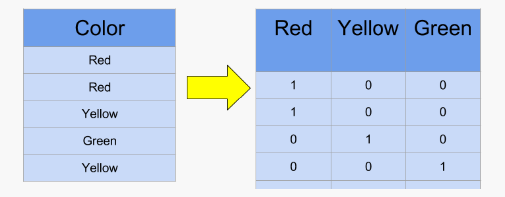
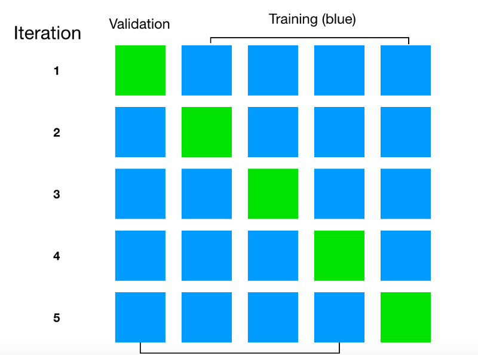
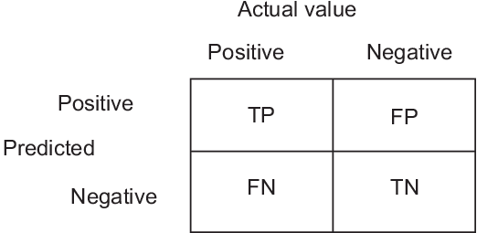
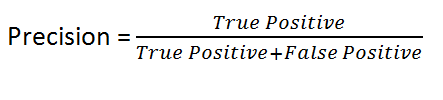
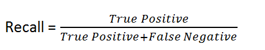
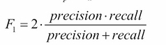
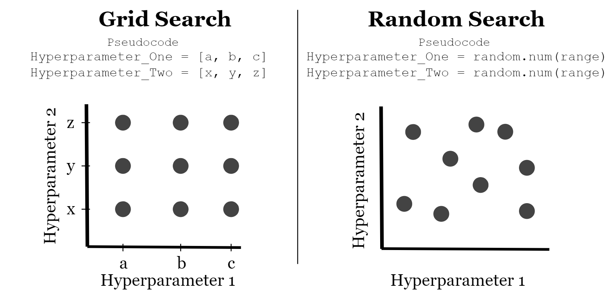

# Income Prediction
Project showing the usual procedure of a data science/ machine learning project, from getting the data to delivering the model.

In this project, data extracted from the 1994 census is used to predict and individual's income level.
# Content
 - **[The Dataset](#the-dataset)**
 - **[Data visualization and Preprocessing](#data-visualization-and-preprocessing)**
   - **[Handling missing data](#handling-missing-data)**
   - **[Numerical features](#numerical-features)**
   - **[Categorical features and encoding: Label encoding vs One-hot encoding](#categorical-features-and-encoding-label-encoding-vs-one-hot-encoding)**
   - **[Checking correlation](#checking-correlation)**
 
 - **[Model Selection](#model-selection)**
   - **[Cross Validation score](#cross-validation-score)**
   - **[Confusion matrix](#confusion-matrix)**
   - **[Accuracy score](#accuracy-score)**
   - **[Recall score](#recall-score)**
   - **[F1 score](#f1-score)**
   - **[Area under ROC curve](#area-under-roc-curve)**
   - **[Models tested](#models-tested)**
   
 - **[Fine-Tuning The Model](#fine-tuning-the-model)**
   - **[Grid Search and Randomized Search](#grid-search-and-randomized-search)**
   - **[Feature Importance](#feature-importance)**

## The Dataset
This dataset in based in the 1994 Census Data, it can be found [here](https://archive.ics.uci.edu/ml/datasets/Adult).

The features contained in the dataset are as follow:
 - age (numerical)
 - workclass (categorical)
 - fnlwgt (numerical)
 - education (categorical)
 - education_num (numerical)
 - marital_status (categorical)
 - occupation (categorical)
 - relationship (categorical)
 - race (categorical)
 - sex (categorical)
 - capital_gain (numerical)
 - capital_loss (numerical)
 - hours_per_week (numerical)
 - native_country (categorical)
 - income_category (**Categorical. Target feature: the one the model will try to predict**)
 
 Full description of the dataset can be found on the website.
 The unprocessed dataset can be found in the **unprocessed_data** folder.
 
 ## Data Visualization and Preprocessing
 
 The first step in any data science/machine learning project is to try to understand the dataset and visualize the data in order to find some patterns.
 
 ### Handling missing data
 Most datasets will come with some missing data, some values from some entry can be unknown.
 
 After checking this dataset, it is noticeable that some entries are missing workclass, occupation and native country information. Since these are categorical features, it is not very useful to fill the missing data with the average value or the median, since that's not meaningful in categorical features, therefore, those entries are just dropped.
 ### Numerical features
 Numeric features are a bit more easy to visualize and process because they already are in a numeric basis, so most mathematical operations can be performed on them. 
 
 One thing to note is that most models don't handle well features with different ranges (ex: age can be somewhere in the interval [18, 100] while education_num is ussually in the [5,20] interval). In order to prevent this problem, the numerical features are **standardized**.
 
 In the standardization process the data is rescaled in order to have a mean value of 0 and  standard deviation of 1. This is achieved by subtracting each element by the mean and dividing the result by the standard deviation.
 
 
 
 ### Categorical features and encoding: Label encoding vs One-hot encoding
 Categorical features usually require more work than numerical features, due to them not being in a mathematically malleable state.
 
 Therefore these features should be encoded to a numerical value. We have two ways to do this.
 
 **Label Encoding**: This is the most straight-forward of encoding features. For each feature we just attribute a number to each class. For example, let's say we have a feature which is the animal's race: cat, dog, rat. We get cat - 0, dog - 1 and rat - 2.
 
 This can result in a problem regarding numerical order since cat, dog and rat don't have any kind of relation between them, but the numbers 0, 1 and 2 have: we can say that 2 is the double of 1 but we can't say that rat is the double of dog, but the classifier can learn these relations and be induced into wrong predictions.
 
 To solve this problem the features can be encoded using One-Hot Encoding. 
 
 **One-Hot Encoding** implies creating a column for each class of a feature. Then, for each entry, only one of these columns will have the value 1, this will be the column corresponding to the class of the entry, the image below may help to understan how the encoding works.
 
 
 
 This being said, after conducting some experiments with this dataset, there's no significant difference in accuracy between normally encoding the features or one hot encoding them, so, for simplification reasons, the features are just normally encoded.
 
 These features are then also standardized as the numerical features were.
 
 ### Checking correlation
 After handling the features, the correlation matrix is calculated. This is a matrix that shows how each features correlates to the others. After checking the correlations to "income_category", the feature "fnlwgt" is dropped since it has almost no correlation.
 
 Some dimensionality reduction techniques, such as PCA, could be applied, but since this is already a dataset with few features, there's no significant practical advantage to it.
 
 The dataset is now preprocessed and the search for a good model can start.
 
 The dataset was stored in the **preprocessed_data** folder.
 
## Model Selection
There are many models that can be used for binary classification, so there has to be some way of comparing them in order to decide which one to use. Fortunately there are, and there are many.

### Cross Validation Score
This is a way of getting a model's score on the training data without overfitting the model/estimator. The data is divided in k splits. For k times, k-1 data folds are given to the model as training data and the remaining fold is used as test data, providing a score for that fold. 

The k scores are then averaged to get the real score.


### Confusion Matrix

The confusion matrix is a matrix where the rows indicate the true label of the data and the columns indicate what the model predicted. (The roles of the columns and rows can swap sometimes)

The image below exemplifies a confusion matrix for a binary classification problem:


In this example, there we're 60 NO instances. Of them, 50 we're classified as NO's and 10 we're classified as YES.

This view of the model's prediction can be used to introduce some terms:

 - True positive(TP) - when the model guesses a entry of data belongs to the true class and it is correct.

 - True negative(TN) - when the model guesses a entry of data doesn't belong to the true class and it is correct.

 - False positive(FP) - when the model gueses a entry of data belongs to the true class and it is incorrect.

 - False Negative(FN) - when the model gueses a entry of data doesn't belong to the true class and it is incorrect.



### Accuracy Score

Knowing these terms, some useful metrics can be calculated.

The first one is accuracy. The accuracy score measures how many of the entries that the model predicted were positive were actually true.

This is done by dividing the number of true positives by the sum of True Positives and False Positives.


### Recall Score
The recall score measures of all the Positive entries, how many did the model classify as Positive. This can be viewed as the model's *sensitivity*, or how willing it is to classify something as true.



### F1 Score
The f1 is a combination of the precision and recall metris. It is the harmonic mean of the two, which means it gives much more weight to low values.



### Area under ROC Curve
The ROC curve (receiver operating characteristics) plots the True Positive Rate against the False Positive Rate. It plots the model's sensitivity agains't it's willingness to classify more data as true.

The perfect classifier wil have a TPR or 1 to a FPR of 1, therefore, the area under the ROC curve for the ideal model would be 1. So, a way to compare model's it to see how the value of the Area under Cure (AUC or AOC)


### Models tested
The following estimators we're tested:
- Naive Bayes Classifier
- K Neighbors Classifier
- Decision Tree Classifier
- Random Forest Classifier

On all the metrics, Random Forest Classifier had the best results.


## Fine-tuning the model
Now, that the model to use is decided, it needs to be fine-tuned to increase performance.
A technique to find the model's parameters who give it the best accuracy has to be implemented. 

As in most machine learning, some things are usually done empirically instead of analytically. That is the case of techniques to fine tune an algorithm.
 
One of the most used techniques is called grid search.

### Grid Search and Randomized Search
In the grid search technique, a dict of what hiperparameters' values to test is defines. Those values are then tested in combination (forming a grid), and the best combination is returned.

The search range is then reduced as an attempt to find better parameters

Example of the evolution of a dict:
 
```python 

 param_grid = [
    {'n_estimators':[10,50,100,200],'max_features':[3,6,9,12]},
 ]

#first result {'max_features': 3, 'n_estimators': 200}

param_grid = [
    {'n_estimators':[200,400,600],'max_features':[2,3,4]},
]
#second result {'max_features': 3, 'n_estimators': 400} score:  0.8448207171314741

param_grid = [
    {'n_estimators':[350,400,450],'max_features':[3]},
]
#third result {'max_features': 3, 'n_estimators': 450} score:  0.8462815405046481


```

Another technique is to, instead of defining the hiperparameters' values to test, define an interval and let the algorithm stochastically take numbers from the interval for the hyperparameters and test them. This is called **Randomized Search**.



### Feature importance
After the hyperparameter searching process is over, the importance of the features to the classifier can be checked.
 
 The more irrelevant features can be dropped to see if that implies any increase in the model's score.

And that's it! The model can now be used to guess some $$$.

